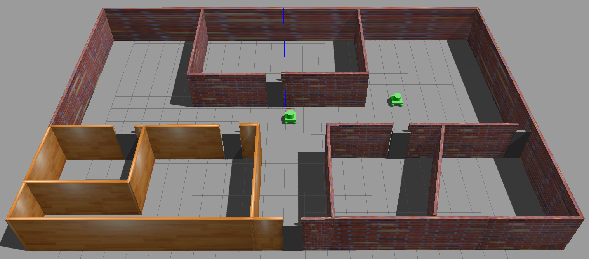
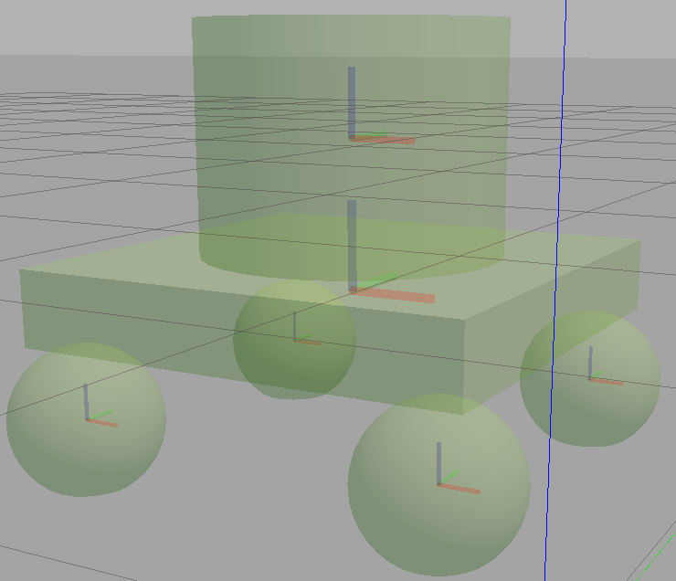
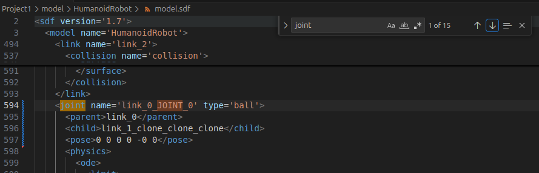

# Title : Project1 Submittion
- Nano Degree : Robotic Software Engineer
- Course : 2. Gazebo Basics

# Project Rubric

## 1. Basic Requirements

### Criteria
Does the project include a world directory containing the Gazebo world file, a model directory containing a structure and an object model files, a script directory containing the C++ plugin code, and a CMakeLists.txt file?

### Requirements
The student submitted all required files specified in the criteria.

### Results
These are my files.

```bash
Project1/
├── CMakeLists.txt
├── README.md
├── build.sh
├── common.sh
├── images
│   ├── fig_01_model.png
│   ├── fig_02_model.png
│   └── fig_03_joint.png
├── model
│   ├── Building
│   │   ├── model.config
│   │   └── model.sdf
│   └── HumanoidRobot
│       ├── model.config
│       └── model.sdf
├── run_gazebo.sh
├── script
│   └── welcome_message.cpp
└── world
    └── UdaCityOffice.world
```    

## 2. Building

### Criteria
Does the project include a house with walls?

### Requirements
The student designeda structure and stored it in the model directory.
Structure basic requirements:
• Structure is different than the one shown in the sample simulation world.
• Single floor.
• Enough space for robots to navigate.
• At least one feature.
• At least one color.

### Results
This is my world.


fig-01. My World


## 3. Modeling

### Criteria
Does the project include an object built using the Model Editor?

### Requirements
The student designed an object and stored it in the model directory.
Model basic requirements:
• Object is different than the one shown in the sample simulation world.
• Object links are connected through joints.

### Results
This is my model.

fig_02_model

In ./HumanoidRobot.model.sdf, there are 6 joints.


## 4. Gazebo World

### Criteria
Doe the project contain a Gazebo world with multiple models?

### Requirements
The student created a Gazebo world and stored it in the world directory.
Gazebo World basic requirements:
• World is different than the one shown in the sample simulation world.
• Contains the structure model.
• Contains two instances of the object model.
• Contains one model from the Gazebo online library.

### Results
Refer to fig-01.

## 5. World Plugin

### Criteria
Does the project contain a C++ world plugin?

### Requirements
The student created a C++ plugin and stored it in the script directory. Also, the student created a CMakeLists.txt file and stored in the main project directory.
World plugin basic requirements:
• The plugin C++ code should print “Welcome to ’s World!” message.
• Do not submit the build directory!

### Results
I wrote a refference command in UdaCityOffice.world like below.


Run ./run_gazebo.sh, then you will see below.


