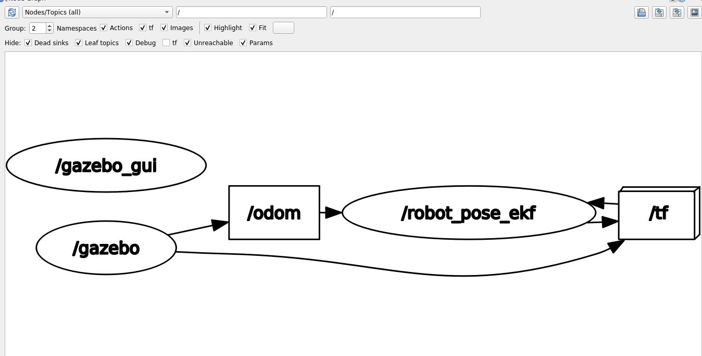

# Setup for 3.6
```
# build docker image
cd ./docker1_noetic/
./build.sh

# start container ROS (Noetic)
./start.sh

# enter into the container
./into.sh

# ROS Build
cd ../catkin_ws2_noetic/

# create base env
./00_create_cmake.sh

# build catkin
./01_catkiin_build.sh

# launch node
./11_launch_turtlebot3_world.sh
./13_launch_robot_pose_ekf.sh

# launch rqt_graph
./14_run_rqt_graph.sh
```

