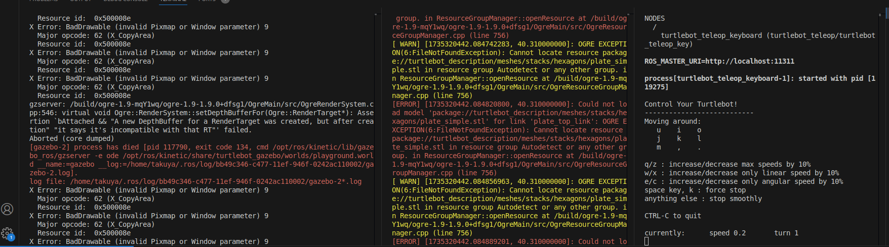

# Setup for 3.9: Rviz Package
```
# build docker image
cd ./docker2_kinetic/
./build.sh
```
```
# start container ROS (Kinetic)
./start.sh
```
```
# enter into the container
./into.sh
```
```
# ROS Build
cd ../catkin_ws2_kinetic/
```
```
# create base env
./00_create_cmake.sh
```
```
# build catkin
./80_clone_turtlebot_sim.sh
./81_copy_launch_file_ekf.sh
./82_install_dependencies.sh
./83_clone_robot_pose_ekf.sh
./84_clone_odom_to_traj.sh
./85_clone_turtlebot.sh
./86_install_dependencies.sh
./01_catkiin_build.sh
```
```
# launch node
./11_launch_turtlebot_world.sh
./13_launch_robot_pose_ekf.sh
./14_launch_odom_to_traj.sh
./15_launch_teleop.sh
```
```
# In the terminal of teleop, I can move a robot by keyboard inputs.

# launch Rviz
# This leads gazebo crash! ---> I will show you the detail in the later part.
./16_launch_rviz.sh  

```



---
# Gazebo Terminal Error
```
X Error: BadDrawable (invalid Pixmap or Window parameter) 9
  Major opcode: 62 (X_CopyArea)
  Resource id:  0x500008e
X Error: BadDrawable (invalid Pixmap or Window parameter) 9
  Major opcode: 62 (X_CopyArea)
  Resource id:  0x500008e
gzserver: /build/ogre-1.9-mqY1wq/ogre-1.9-1.9.0+dfsg1/OgreMain/src/OgreRenderSystem.cpp:546: virtual void Ogre::RenderSystem::setDepthBufferFor(Ogre::RenderTarget*): Assertion `bAttached && "A new DepthBuffer for a RenderTarget was created, but after creation" "it says it's incompatible with that RT"' failed.
Aborted (core dumped)
[gazebo-2] process has died [pid 117790, exit code 134, cmd /opt/ros/kinetic/lib/gazebo_ros/gzserver -e ode /opt/ros/kinetic/share/turtlebot_gazebo/worlds/playground.world __name:=gazebo __log:=/home/takuya/.ros/log/bb49c346-c477-11ef-946f-0242ac110002/gazebo-2.log].
log file: /home/takuya/.ros/log/bb49c346-c477-11ef-946f-0242ac110002/gazebo-2*.log
X Error: BadDrawable (invalid Pixmap or Window parameter) 9
  Major opcode: 62 (X_CopyArea)
  Resource id:  0x500008e
X Error: BadDrawable (invalid Pixmap or Window parameter) 9
  Major opcode: 62 (X_CopyArea)
  Resource id:  0x500008e
```


# Rviz Terminal Error
```
[ INFO] [1735320441.712263744, 40.000000000]: Stereo is NOT SUPPORTED
[ INFO] [1735320441.712558311, 40.000000000]: OpenGl version: 3 (GLSL 1.3).
[ERROR] [1735320442.054178401, 40.310000000]: The STL file 'package://turtlebot_description/meshes/stacks/hexagons/plate_simple.stl' is malformed. It starts with the word 'solid' and also contains the word 'endsolid', indicating that it's an ASCII STL file, but rviz can only load binary STL files so it will not be loaded. Please convert it to a binary STL file.
[ERROR] [1735320442.054228150, 40.310000000]: Failed to load file [package://turtlebot_description/meshes/stacks/hexagons/plate_simple.stl]
[ WARN] [1735320442.054322014, 40.310000000]: OGRE EXCEPTION(6:FileNotFoundException): Cannot locate resource package://turtlebot_description/meshes/stacks/hexagons/plate_simple.stl in resource group Autodetect or any other group. in ResourceGroupManager::openResource at /build/ogre-1.9-mqY1wq/ogre-1.9-1.9.0+dfsg1/OgreMain/src/OgreResourceGroupManager.cpp (line 756)
```